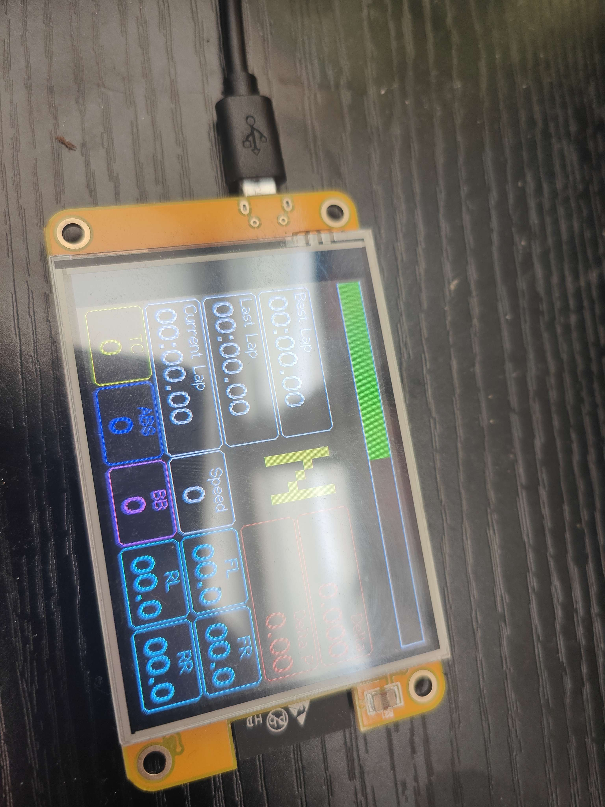
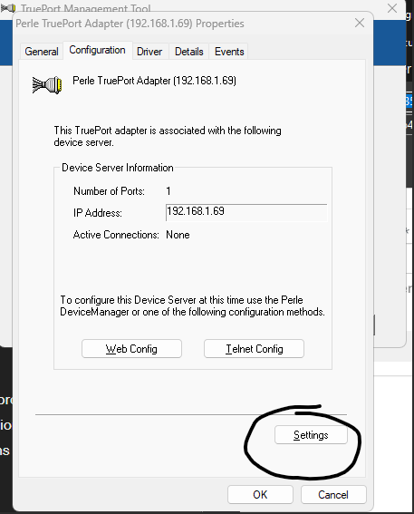
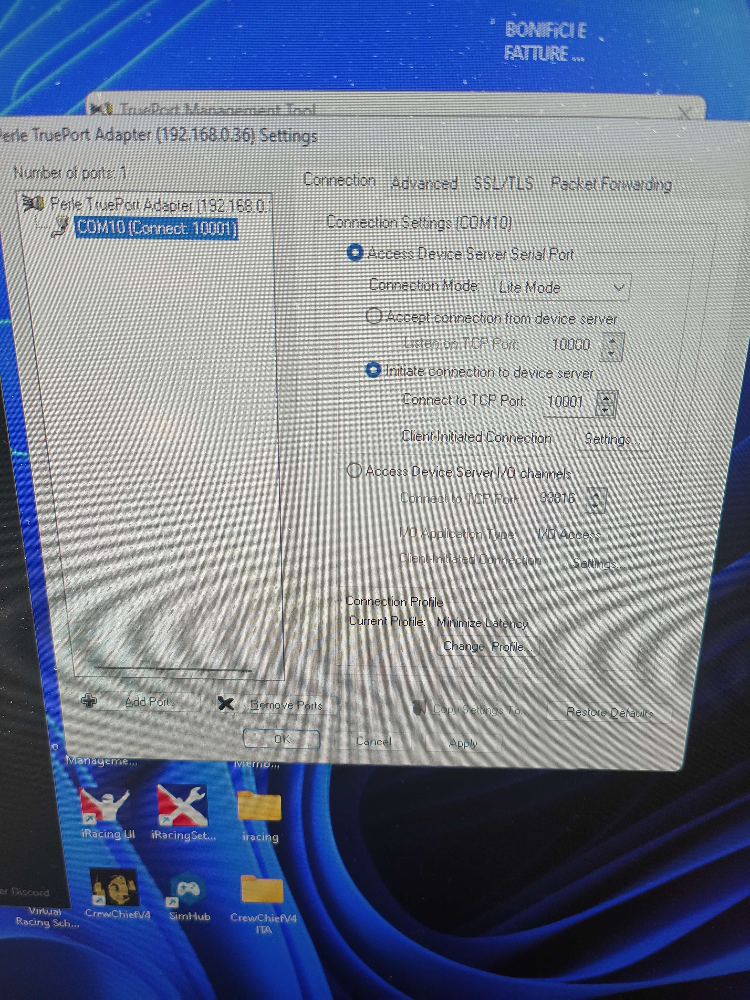
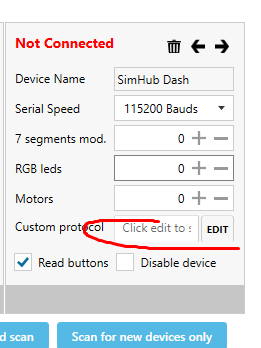

# SimHub firmware for ESP32 sunton display

It is original project:

https://github.com/eCrowneEng/ESP-SimHub

https://github.com/MoemenMostafa/simhub-esp-dashboard

I some Adjust for  ESP32-2432S028:

https://macsbug.wordpress.com/2022/08/17/esp32-2432s028/

# Display setting to SHCustomProtocol.h

..........

// selezione la configurazione nella cartella lgfx_user

// #include <LGFX_AUTODETECT.hpp>  // Preparare la classe "LGFX"

// #include <lgfx_user/LGFX_ESP8266_sample.hpp>

#include <lgfx_user/LGFX_ESP32_esp32-2432s028.hpp>

#include <Arduino.h>

// #include <TFT_eSPI.h> // Hardware-specific library

// #include <SPI.h>

#include <map>

......

# SimHub firmware for ESP32 and ESP8266

Head over to the discord server to discuss this firmware: https://discord.gg/zw377qhj9c 

## What is this?
Firmware source code for ESP32 and ESP8266 that is compatible with SimHub. It's derived from what SimHub lets you setup, but tweaked with a thin compatibility layer for the ESP32 and ESP8266.

## Why would you want to do this?
ESP8266 is cheaper and more powerful that most arduinos boards and fairly popular in the IoT Community. The ESP32 is a very handy little monster to use too.

## How To
- Download this code
- Install [Git](https://git-scm.com/downloads)
- Install [VSCode](https://code.visualstudio.com/Download) and [Platformio](https://platformio.org/platformio-ide)
- Open with VSCode
- Adjust it however you need
- Upload it to your device

## Why Platformio?
It's better in almost every way than Arduino IDE, but more generic and more strict. It's worth learning it, trust me.

## How does the SimHub WiFi connection works?
SimHub assumes there is a serial port that it can talk to, and a certain protocol that accounts for errors [Automatic Repeat Request](https://en.wikipedia.org/wiki/Automatic_repeat_request).

Instead of having a local device connected to the computer directly, we create a "virual com port" that forwards all communication to a certain IP.

On the Microcontroller side, we modify the code to create a socket server receiving data on the right port, we put that data in a buffer (similar to
the serial port) and we allow the modified Arduino SimHub client to consume it from the buffer, as if it was a normal seial connection.

## How to configure the firmware to use WiFi
Set the [preprocessor directive](https://cplusplus.com/doc/tutorial/preprocessor/) called INCLUDE_WIFI to true (in src/main.cpp). Set DEBUG_TCP_BRIDGE to true as well, and set `monitor_speed = 115200` in `platformio.ini`.

## How to connect the ESP to your WiFi
Upload a [WiFi enabled](https://github.com/eCrowneEng/ESP-SimHub/blob/main/src/main.cpp#L4) firmware. Connect USB to computer and open the serial monitor with `115200` baud rate (to catch debug messages). Power the ESP up. 

(If you hardcoded WiFi credentials already, skip this paragraph) It will itself create a new WiFi network (ESP-{a bunch of letters and numbers}) that you can connect to from your phone or computer. Connect to that network and navigate to `http://192.168.4.1`, observe a [captive portal](https://en.wikipedia.org/wiki/Captive_portal). Configure your WiFi and then disconnect.

Once the ESP is connected to a network, it won't create its own. The device should output the IP address it's using, write it down, you'll need it.

If you have access to your router settings, it's worth setting a static ip address or a DHCP reservation to the ESP.. that way you won't have to reconfigure the virtual port every few reconnections.

## How to configure the virtual port
Download [Perle TruePort](https://www.perle.com/downloads/trueport.shtml). Install it. Configure a new COM port. Forward the data to the IP address of your ESP. [Check the manual on the section called "Configuring the COM Port Connection" > "Access Device Server Serial Port"](https://www.perle.com/downloads/drivers/trueport/windows/windows_ug.pdf) Follow the instructions to set it up in LITE mode. .. and that should be it.

## How to configure SimHub to use the virtual port
SimHub should see the virtual port as a normal COM port, and it should be able to "scan it" and do the normal handshake process to query and use it. After confirming everything works, you can upload a new ESP firmware without debug logging.

## How to configure SimHub to use custom protocol
SimHub should config use custom protocol:
1) go in menu
   
   
2)  copy text :https://github.com/1achy/https---github.com-1achy-SIMHUB-ESP32---SUNTON-screen/blob/main/istruzioni%20simhub%20protocol%20custom/customProtocol-dashBoard.txt
3)  paste

## ESP32 Support Caveats
Some Arduino APIs for the ESP32 are different, so not everything will work out of the box, but I got the WiFi bridge working and the ShakeIt fans with some effort, as you need to use different includes etc. It's very likely that other features that I haven't tested will need tweaks. But if you're willing to experiment with this, feel free to do so. Checkout this PR https://github.com/eCrowneEng/ESP-SimHub/pull/1 as an example of the things you need to do to achieve compatibility.

### How to enable ESP32
- Open `platformio.ini`, comment out the ESP8266 env and Uncomment the ESP32 env. Also specify your board in the env, by default is set to something like `esp32doit-devkit-v1` because I owned this board, but there are tons of boards for the ESP32, as you can see [here](https://docs.platformio.org/en/latest/boards/index.html#espressif-32). Click on one and it will show you what's its id. 
- Make sure to use the correct pin numbers for the ESP32 as opposed to aliases such as D1, D2, D3.. etc
